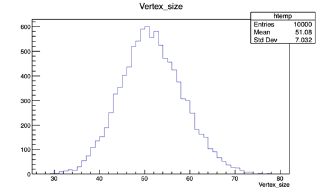
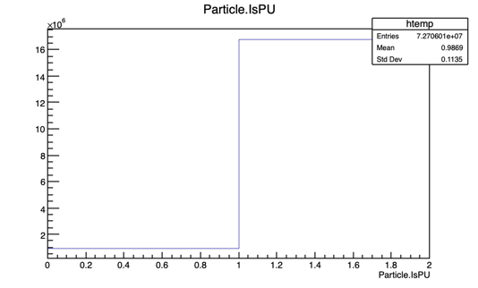

# Run Delphes with Pile-Up

[toc]

## Syntax

**Input**: a configuration card(.tcl) and a monte-carlo event file(.hepmc .hep .lhef)

**Output**: a ROOT output file

```bash
$ DelphesSTDHEP -h
Usage: DelphesSTDHEP config_file output_file [input_file(s)]
 config_file - configuration file in Tcl format,
 output_file - output file in ROOT format,
 input_file(s) - input file(s) in STDHEP format,
 with no input_file, or when input_file is -, read standard input.
```


## Mixing pile-up

`PileUpMerger` module

Some parameters can customize: `PileUpFile` `MeanPileUp` `PileUpDistribution` `ZVertexWidth` `ZVertexResolution`

1.  PileUpFile

   One defalut one (**MinBias.pileup**) is provided. 

   Can generate 

2. MeanPileUp

3. PileUpDistribution

   0 for Poisson, 1 for Uniform.

   2 for Delta. 

4. ZVertexSpread

   Can set distribution formula e.g.

   `set VertexDistributionFormula {exp(-(t^2/(2*(0.05/2.99792458E8*exp(-(z^2/(2*(0.05)^2))))^2)))}`


run in the normal way: 

```bash
$ DelphesSTDHEP cards/delphes_card_CMS_PileUp.tcl output.root input.hep
```


## Save Pile-up Info

NOTE: If comparing the Delphes output ROOT file from different cards `delphes_card_CMS.tcl` and `delphes_card_CMS_PileUp.tcl`, stable particles from PU vertices are not saved. 


To do this, modify the card file to save `stableParticles` from `PileUpMerger` : 

```tcl
module TreeWriter TreeWriter {
# add Branch InputArray BranchName BranchClass
# add Branch Delphes/allParticles Particle GenParticle

# Save all partilces (including PU)
  add Branch PileUpMerger/stableParticles Particle GenParticle  
  ...
}
```


## Merge 

### Input 

input file for the hard event: `z_ee.hep` (this is provided by delphes official, 10,000 events)

```bash
$ wget http://cp3.irmp.ucl.ac.be/downloads/z_ee.hep.gz
$ gunzip z_ee.hep.gz
```

### Run

Run modified `delphes_card_CMS_PileUp.tcl`, 

```bash
$ DelphesSTDHEP cards/delphes_card_CMS_PileUp.tcl z_ee_PileUp50.root z_ee.hep
```

### Results

#### vertex distribution



#### particles_isPU distribution



#### print truth information 

Run [dumpVertex.C](./dumpVertex.C)

`root -l dumpVertex.C'("z_ee_PileUp50.root")'`

1. first 5 vertices and first 50 stable partilces in event 0: 

   ```bash
   $ root -l dumpVertex.C'("z_ee_PileUp50.root")'
   root [0]
   Processing dumpVertex.C("z_ee_PileUp50.root")...
   number Of Entries  10000
   ------------- Event 0--------------------
   Number of primary vertices: 47
   Number of stable particles: 7358
   
   Event 0 Particles info
             Index	PID	Status	IsPU	M1	M2	D1	D2	Charge	Mass	E	Px	Py	Pz	Vtx	Vty	Vtz	Vtt
            0	-11	1	0	10	-1	-1	-1	1	0.00051	46.58736	38.08628	-26.39637	-4.80103	0.00000	0.00000	-29.88551	-0.00000
            1	22	1	0	10	-1	-1	-1	0	0.00000	0.00024	0.00024	-0.00003	0.00001	0.00000	0.00000	-29.88551	-0.00000
            2	11	1	0	11	-1	-1	-1	-1	0.00051	58.04054	-24.34441	16.64992	49.98833	0.00000	0.00000	-29.88551	-0.00000
            3	2112	1	0	29	-1	-1	-1	0	0.93957	789.84601	-0.50749	0.16628	789.84528	0.00000	0.00000	-29.88551	-0.00000
            4	-211	1	0	29	-1	-1	-1	-1	0.13957	51.77132	-0.47657	0.62481	51.76517	0.00000	0.00000	-29.88551	-0.00000
            5	-211	1	0	29	-1	-1	-1	-1	0.13957	22.56901	-0.47132	-0.12528	22.56331	0.00000	0.00000	-29.88551	-0.00000
            6	-211	1	0	29	-1	-1	-1	-1	0.13957	5.08667	0.00241	-0.18980	5.08121	0.00000	0.00000	-29.88551	-0.00000
            7	211	1	0	29	-1	-1	-1	1	0.13957	5.24729	0.27282	0.17788	5.23531	0.00000	0.00000	-29.88551	-0.00000
            8	-211	1	0	29	-1	-1	-1	-1	0.13957	3.82163	0.34512	-0.28325	3.79289	0.00000	0.00000	-29.88551	-0.00000
            9	321	1	0	54	-1	-1	-1	1	0.49360	47.04367	-0.29202	-0.01231	-47.04017	0.00000	0.00000	-29.88551	-0.00000
           10	-211	1	0	54	-1	-1	-1	-1	0.13957	0.36938	0.04142	0.22922	-0.25041	0.00000	0.00000	-29.88551	-0.00000
           11	211	1	0	54	-1	-1	-1	1	0.13957	0.57408	-0.42810	-0.26536	0.23750	0.00000	0.00000	-29.88551	-0.00000
           12	-211	1	0	54	-1	-1	-1	-1	0.13957	3.02109	-2.52954	0.46557	1.57867	0.00000	0.00000	-29.88551	-0.00000
           13	-211	1	0	54	-1	-1	-1	-1	0.13957	1.18281	-0.84508	-0.48907	0.65285	0.00000	0.00000	-29.88551	-0.00000
           14	2212	1	0	72	-1	-1	-1	1	0.93827	81.18072	-0.78673	0.41981	-81.17040	0.00000	0.00000	-29.88551	-0.00000
           15	-211	1	0	30	-1	-1	-1	-1	0.13957	460.10883	-0.17301	0.55616	460.10843	0.00000	0.00000	-29.88551	-0.00000
           16	211	1	0	30	-1	-1	-1	1	0.13957	400.42172	0.22616	0.04757	400.42163	0.00000	0.00000	-29.88551	-0.00000
           17	-211	1	0	32	-1	-1	-1	-1	0.13957	797.87518	0.27087	-0.19220	797.87506	0.00000	0.00000	-29.88551	-0.00000
           18	211	1	0	32	-1	-1	-1	1	0.13957	182.62979	0.10123	0.08932	182.62968	0.00000	0.00000	-29.88551	-0.00000
           19	211	1	0	34	-1	-1	-1	1	0.13957	21.14621	-0.14976	-0.06489	21.14512	0.00000	0.00000	-29.88551	-0.00000
           20	211	1	0	36	-1	-1	-1	1	0.13957	15.89046	-0.11613	0.18384	15.88836	0.00000	0.00000	-29.88551	-0.00000
           21	-211	1	0	36	-1	-1	-1	-1	0.13957	40.38886	-0.57238	-0.21319	40.38400	0.00000	0.00000	-29.88551	-0.00000
           22	211	1	0	37	-1	-1	-1	1	0.13957	5.49201	-0.12361	0.07059	5.48840	0.00000	0.00000	-29.88551	-0.00000
           23	22	1	0	38	-1	-1	-1	0	0.00000	18.40489	-0.20227	0.02518	18.40376	-0.00005	0.00002	-29.88147	-0.00000
           24	22	1	0	38	-1	-1	-1	0	0.00000	23.42213	-0.31656	0.17234	23.41936	-0.00005	0.00002	-29.88147	-0.00000
           25	211	1	0	40	-1	-1	-1	1	0.13957	46.49902	-0.78226	-0.40343	46.49047	0.00000	0.00000	-29.88551	-0.00000
           26	211	1	0	41	-1	-1	-1	1	0.13957	7.64042	-0.13308	0.19590	7.63547	0.00000	0.00000	-29.88551	-0.00000
           27	-211	1	0	41	-1	-1	-1	-1	0.13957	38.51161	-0.92949	1.33087	38.47713	0.00000	0.00000	-29.88551	-0.00000
           28	211	1	0	43	-1	-1	-1	1	0.13957	5.35951	-0.06519	0.27431	5.35027	0.00000	0.00000	-29.88551	-0.00000
           29	-211	1	0	44	-1	-1	-1	-1	0.13957	1.05110	-0.15927	-0.09930	1.02475	0.00000	0.00000	-29.88551	-0.00000
           30	211	1	0	45	-1	-1	-1	1	0.13957	2.96461	-0.32023	-0.02728	2.94384	0.00000	0.00000	-29.88551	-0.00000
           31	-211	1	0	45	-1	-1	-1	-1	0.13957	6.32765	-0.14553	0.41020	6.31112	0.00000	0.00000	-29.88551	-0.00000
           32	211	1	0	46	-1	-1	-1	1	0.13957	3.76770	-0.15549	0.25409	3.75331	0.00000	0.00000	-29.88551	-0.00000
           33	-211	1	0	46	-1	-1	-1	-1	0.13957	5.24680	-0.25789	0.38703	5.22428	0.00000	0.00000	-29.88551	-0.00000
           34	-211	1	0	48	-1	-1	-1	-1	0.13957	1.81463	0.05028	0.29081	1.78502	0.00000	0.00000	-29.88551	-0.00000
           35	211	1	0	48	-1	-1	-1	1	0.13957	2.19239	-0.04050	0.05869	2.18679	0.00000	0.00000	-29.88551	-0.00000
           36	211	1	0	51	-1	-1	-1	1	0.13957	0.79805	-0.16953	-0.11663	0.75833	0.00000	0.00000	-29.88551	-0.00000
           37	211	1	0	52	-1	-1	-1	1	0.13957	0.43905	-0.13070	0.09474	0.38370	0.00000	0.00000	-29.88551	-0.00000
           38	-211	1	0	52	-1	-1	-1	-1	0.13957	0.53377	0.50295	-0.01423	-0.11078	0.00000	0.00000	-29.88551	-0.00000
           39	211	1	0	55	-1	-1	-1	1	0.13957	286.54318	-0.61943	0.51783	-286.54199	0.00000	0.00000	-29.88551	-0.00000
           40	-211	1	0	55	-1	-1	-1	-1	0.13957	351.19656	0.13407	0.33074	-351.19635	0.00000	0.00000	-29.88551	-0.00000
           41	211	1	0	56	-1	-1	-1	1	0.13957	166.32948	0.19345	-0.28142	-166.32907	0.00000	0.00000	-29.88551	-0.00000
           42	-211	1	0	57	-1	-1	-1	-1	0.13957	16.18777	-0.23939	0.22467	-16.18383	0.00000	0.00000	-29.88551	-0.00000
           43	22	1	0	60	-1	-1	-1	0	0.00000	7.58932	-0.23799	0.21900	-7.58242	0.00000	0.00000	-29.88551	-0.00000
           44	22	1	0	61	-1	-1	-1	0	0.00000	1.62678	-0.27076	0.11528	-1.59995	0.00000	0.00000	-29.88551	-0.00000
           45	22	1	0	61	-1	-1	-1	0	0.00000	4.68634	0.13722	0.20152	-4.67999	0.00000	0.00000	-29.88551	-0.00000
           46	211	1	0	64	-1	-1	-1	1	0.13957	3.98046	-0.52402	-1.06154	-3.79778	0.00000	0.00000	-29.88551	-0.00000
           47	-211	1	0	64	-1	-1	-1	-1	0.13957	1.11720	0.09654	0.06057	-1.10257	0.00000	0.00000	-29.88551	-0.00000
           48	-211	1	0	67	-1	-1	-1	-1	0.13957	0.16472	0.05100	-0.05474	-0.04535	0.00000	0.00000	-29.88551	-0.00000
           49	211	1	0	67	-1	-1	-1	1	0.13957	0.37037	-0.25732	-0.15512	-0.16559	0.00000	0.00000	-29.88551	-0.00000
   Event 0 Vertex 0
   Index	vtx_t	vtx_x	vtx_y	vtx_z
       0	-0.00000	-0.02444	0.06269	-29.88551
   Event 0 Vertex 1
   Index	vtx_t	vtx_x	vtx_y	vtx_z
       1	-0.00000	-0.88958	-1.35793	-15.26778
   Event 0 Vertex 2
   Index	vtx_t	vtx_x	vtx_y	vtx_z
       2	0.00000	-0.75168	-0.37841	-33.54140
   Event 0 Vertex 3
   Index	vtx_t	vtx_x	vtx_y	vtx_z
       3	0.00000	0.18114	0.82154	-18.09992
   Event 0 Vertex 4
   Index	vtx_t	vtx_x	vtx_y	vtx_z
       4	-0.00000	0.03312	0.13213	-63.56350
   ```

### Inspect

the vertices of a stable particles seem like only the primary vertices, do not include the secondary vertices which is the case of ATLAS data.  i.e.  hepevt format

| class GenParticle |                                                |                               |
| ----------------- | ---------------------------------------------- | ----------------------------- |
| PID               | particle HEP ID number                         | hepevt.idhep[number]          |
| Status            | particle status                                | hepevt.isthep[number]         |
| IsPU              | 0 or 1 for particles from pile-up interactions |                               |
| M1                | particle 1st mother                            | hepevt.jmohep[number][0\] - 1 |
| M2                | particle 2nd mother                            | hepevt.jmohep[number][1\] - 1 |
| D1                | particle 1st daughter                          | hepevt.jdahep[number][0\] - 1 |
| D2                | particle last daughter                         | hepevt.jdahep[number][1\] - 1 |
| Charge            | particle charge                                |                               |
| Mass              | particle mass                                  |                               |
| E                 | particle energy                                | hepevt.phep[number][3\]       |
| Px                | particle momentum vector (x component)         | hepevt.phep[number][0\]       |
| Py                | particle momentum vector (y component)         | hepevt.phep[number][1\]       |
| Pz                | particle momentum vector (z component)         | hepevt.phep[number][2\]       |
| P                 | particle momentum                              |                               |
| PT                | particle transverse momentum                   |                               |
| Eta               | particle pseudorapidity                        |                               |
| Phi               | particle azimuthal angle                       |                               |
| Rapidity          | particle rapidity                              |                               |
| CtgTheta          | particle cotangent of theta                    |                               |
| D0                | particle transverse impact parameter           |                               |
| DZ                | particle longitudinal impact parameter         |                               |
| T                 | particle vertex position (t component)         | hepevt.vhep[number][3\]       |
| X                 | particle vertex position (x component)         | hepevt.vhep[number][0\]       |
| Y                 | particle vertex position (y component)         | hepevt.vhep[number][1\]       |
| Z                 | particle vertex position (z component)         | hepevt.vhep[number][2\]       |

### Question

Although the `Constituents` in `Vertex Class` is declared, but from the source codes of `PileUpMerger.cc`, the member `Constituents` is not given a value. So start from the vertices and trace the particles is not doable.  

Maybe start from partilces and categorize thems into different vertices?

| class Vertex |                                                     |      |
| ------------ | --------------------------------------------------- | ---- |
| T            | vertex position (t component)                       |      |
| X            | vertex position (x component)                       |      |
| Y            | vertex position (y component)                       |      |
| Z            | vertex position (z component)                       |      |
| ErrorT       | vertex position error (t component)                 |      |
| ErrorX       | vertex position error (x component)                 |      |
| ErrorY       | vertex position error (y component)                 |      |
| ErrorZ       | vertex position error (z component)                 |      |
| Index        | vertex index                                        |      |
| NDF          | number of degrees of freedom                        |      |
| Sigma        | vertex position (z component) error                 |      |
| SumPT2       | sum pt^2 of tracks attached to the vertex           |      |
| GenSumPT2    | sum pt^2 of gen tracks attached to the vertex       |      |
| GenDeltaZ    | distance in z to closest generated vertex           |      |
| BTVSumPT2    | sum pt^2 of tracks attached to the secondary vertex |      |
| Constituents | references to constituents                          |      |

## TODO

- [ ] select the charged partilces
- [ ] study how to associate the vertices with stable partilces 

